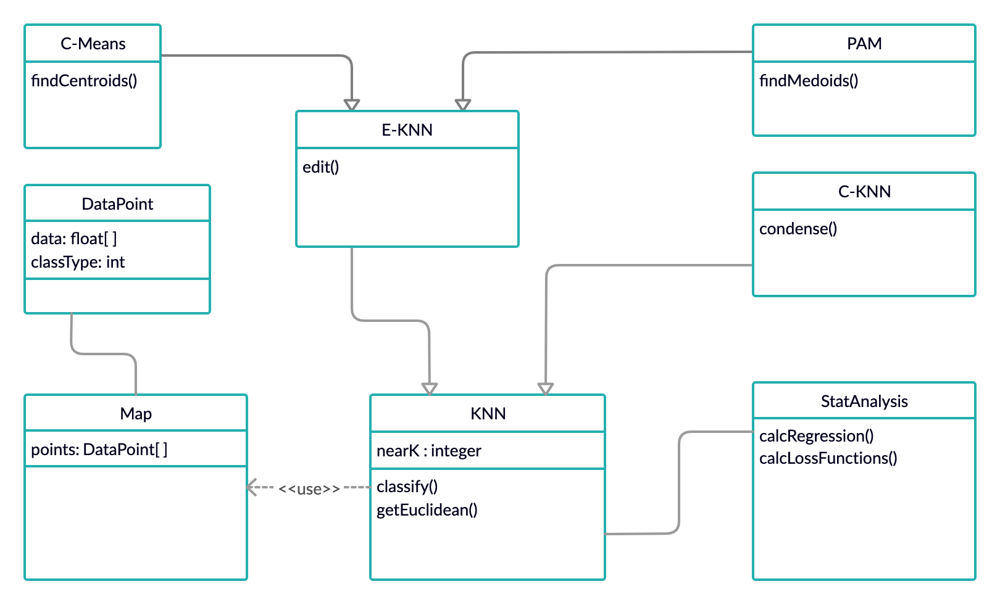

# Project 2 Proposal

## UML Diagram and Descriptions

The KNN class will hold our basic tuning variables such as our number of neighbors we are checking. This class will be able to use a map, calculate the euclidean distance between two points, and classify points from the testing set. 

The E-KNN class will take in a training data, remove points, and repeat for as long as the performance on a separate validation set does not degrade. Through this process a modified dataset is created. 

The C-KNN builds a reduced-size map using training data by adding points to the map if they are incorrectly classified and repeat until no points are added

The C-Means class will use E-KKN to calculate how many centroids it will find. C-Means will then pick random data points, and recalculate the position of our centroids a number of times determined by a tuning variable. The centroides will then be assigned a class value determined by the majority of points within the centroid. The class will then run KNN on the test data with the set of centroids

The PAM class will take the size of the map created by our E-KNN class and uses that as our number of medoids to find. It will then randomly select the locations of that number of datapoints. The class will then use a tuning variable to decide how many times the medoids will be recalculated. Each medoid will be assigned the class value of the majority of points within the medoid. It will then use KNN on a map of the medoids to classify our test data. 

The StatAnalysis class will have functions to calculate loss, and regression. The class could use confusion matrices and associated calculations such as precision and error. To calculate the validity of our regression the class will have a function to calculate the correlation coefficient. If these measures are not useful other statistical measurements will be used.

The Map class will hold a list of all our DataPoints. The driver will be able to instantiate multiple maps to allow for direct comparison of algorithms using maps of medoids, maps of centroids, and maps using the full training set.

The DataPoint class will serve as a container for each row of data within the data set. The features within each point will be represented as a list of floats, with the class attribute (if needed) held in a separate integer variable.

## Experimental Design 

The UML class diagram is representative of the major and important classes to be implemented when coding. The diagram does not include more general code such as the Driver class or data processing as they are not specific to the implementation of these algorithms. The Driver class will do the initial instantiation and allow for easier implementation of multiple runs. The data preprocessing modifies the data as necessary to function within the parameters of the algorithms. It will also be able to remove categorical data or change it into numerical values as needed. Additionally, Tenfold Cross-Validation will be reimplemented from the previous project. Within this code the order of the training set is randomized, then split into 10 roughly equally-sized sections to be used as training and testing sets. These sets will each be applied to each algorithm without intermittent randomization. This will allow for more accurate comparisons once all tests have been completed since each set is random, but each algorithm uses the same random set. 

The abalone and forest fire data sets will be tested with and without their categorical data to see which method will provide better results in classification or regression, respectively. For examle, within the abalone dataset, the sex attribute could skew results since it is difficult to discretize the data with numberical values that still have meaning. There is no obvious way to assign values such that averages, or other mathematical operations, are sensible. For the forest fires a similar problem will arise with attributes such as the month of the year. By testing each data set with and without their categorical data the optimal method can be determined and implemented. 

For statistical analysis the NULL hypothesis is to be assumed for all experiments. The Null hypothesis will be No Relation of any data for the regression tests. KNN, EKNN, and CKNN will be assumed to classify the data perfectly and equivalently.  Clustering via K-means and PAM will have no statistically significant difference when compared to methods without clustering. 

The E-KNN reduced-size map can be created by removing correct or incorrect classifications from the original training set. The optimal option will be determined by testing each method on a random subset of the data and seeing which provides the best results. The chosen method will be used for the remainder of the tests. 

A validation set is required for E-KNN to determine when to stop removing points. This validation set will be created by taking a random subset of the training data. As with Tenfold Cross-Validation the random subsets will be created at the start, then they can be used for each time E-KNN is run. 

For PAM and C-Means a maximum number of times to recalculate medoids or centroids, respectively, will be imposed to ensure that non-converging tests terminate. We will do experimentation ahead of time, after the algorithm has been coded, to determine the optimal maximum value for each data set. 

For C-KNN the number of comparisons that have to pass without Z changing will be determined. One possibility is that this can be proportional to the size of the dataset to ensure a reasonable amount of mismatching and comparisons before termination. Another option would be to use a constant value so each dataset has the same number of opportunities to fail. These can be compared and contrasted with subsets of the test data. For each pass through the data set in C-KNN the training set can be reshuffled each time an iteration is completed through the outermost loop. This may avoid clumps of unclassifiable data in the training data that would prematurely result in breaking out of the outer loop. This method may increase the number of comparisons by more than intended if it is overly successful, or it may have no difference since the data is randomized from the start and the number of failed comparisons may be reached at the same time. This will be investigated once the algorithm is coded and the best option will be chosen based upon accuracy. 

## References

Hastie, T., & Tibshirani, R. (1996). *Discriminant adaptive nearest neighbor classification and regression*. In Advances in Neural Information Processing Systems (pp. 409-415).

Hartigan, J. A., & Wong, M. A. (1979). *Algorithm AS 136: A k-means clustering algorithm*. Journal of the Royal Statistical Society. Series C (Applied Statistics), 28(1), 100-108.
